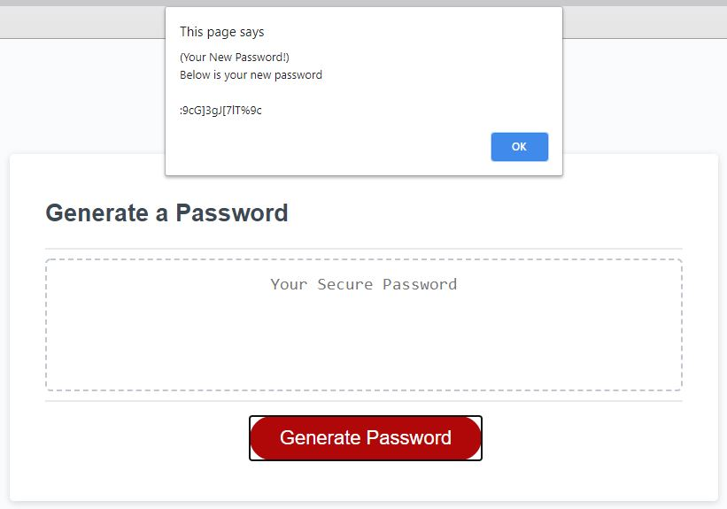

# 03 JavaScript: Password Generator

## The Task

Develop a password generator that outputs passwords of a desired length between 8 -128 inclusive. The password will use a combination special, numeric, uppercase, and lowercase characters desired by the user.  

## User Story

```
AS AN employee with access to sensitive data
I WANT to randomly generate a password that meets certain criteria
SO THAT I can create a strong password that provides greater security

```

## Acceptance Criteria

```
GIVEN I need a new, secure password

WHEN I click the button to generate a password
THEN I am presented with a series of prompts for password criteria

WHEN prompted for password criteria
THEN I select which criteria to include in the password

WHEN prompted for the length of the password
THEN I choose a length of at least 8 characters and no more than 128 characters

WHEN prompted for character types to include in the password
THEN I choose lowercase, uppercase, numeric, and/or special characters

WHEN I answer each prompt
THEN my input should be validated and at least one character type should be selected

WHEN all prompts are answered
THEN a password is generated that matches the selected criteria

WHEN the password is generated
THEN the password is either displayed in an alert or written to the page

```

## Mock-Up

The following image shows the web application's appearance and functionality:


Mock up provided by Trilogy Education Services, LLC, a 2U, Inc. brand. Confidential and Proprietary. All Rights Reserved.
 
## Deployment

Links to the One and Only Password Generator listed below: 

github repo (https://github.com/Jasonrosasramirez/02-Advanced-CSS-Portfolio)
github pages (https://jasonrosasramirez.github.io/02-Advanced-CSS-Portfolio/.)




